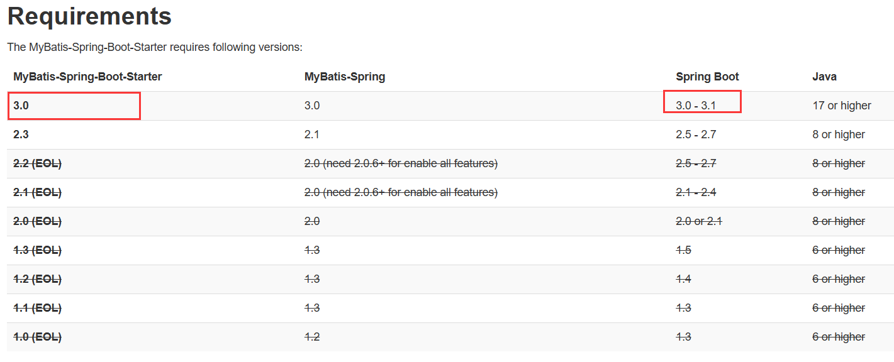

尝试Spring的各种新特性

[Gitee](https://gitee.com/pkmer/springboot-playground)
[Github](https://github.com/hpangka/springboot-playground)

# Version

| Library               | Version |
|-----------------------|---------|
| SpringBoot            | 3.3.0   |
| JDK                   | 17      |
| Maven                 | 3.9.0   |
| Docker Compose        | 2.24.5  |
| mybatis-spring-boot   | 3.0.3   |

SpringBoot版本之所以从3.2.6,迁移到3.1.12的原因是因为mybatis目前3.0版本只支持3.1系列的版本

